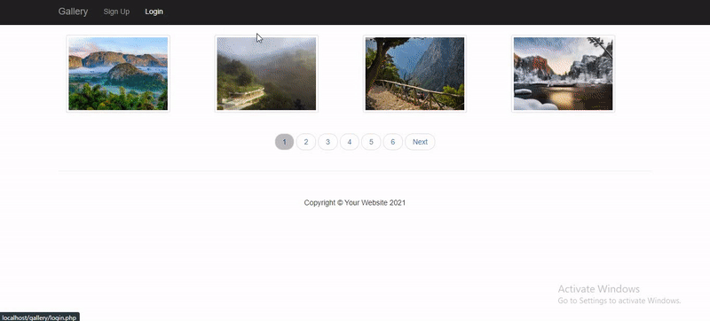

# Gallery Project

## Overview

This is a content management system where you can upload, edit and delete photos. Users can register in the website to add comments to your photos and can add your photos as profile pictures. Admins can track all photos, users, comments through their admin panel where data is shown is graphical and tabular formats.

---

## Technologies Used:

- PHP
- OOP
- MYSQL
- Javascript
- Fetch API
- PHPMailer
