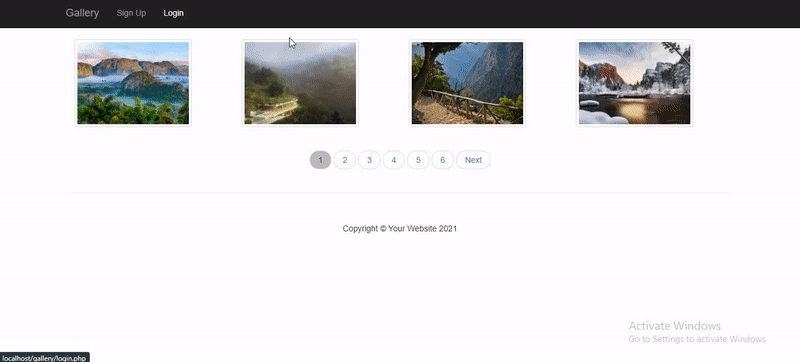
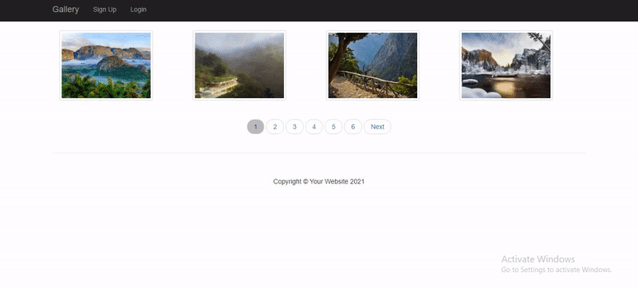
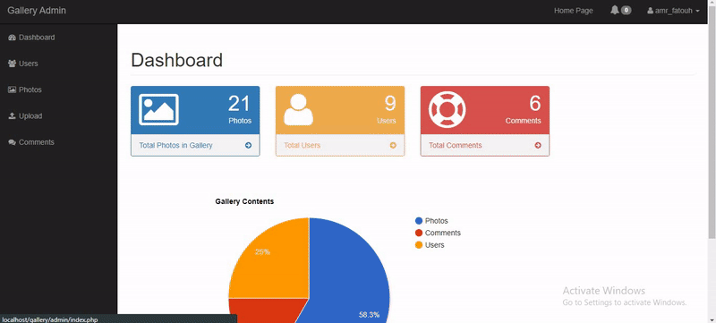
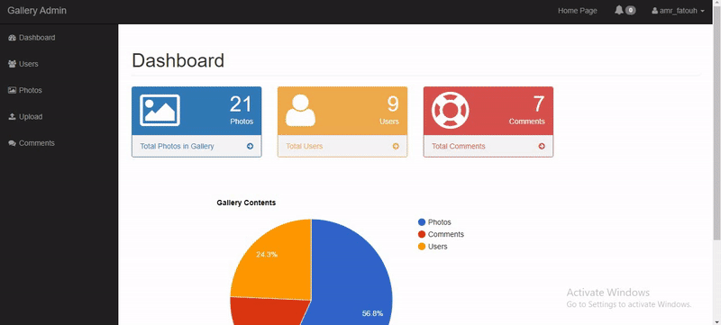
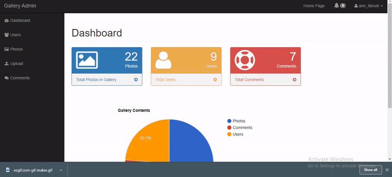

# Gallery Project

## Overview

This is a content management system where you can upload, edit and delete photos. Users can register in the website to add comments to your photos and can add your photos as profile pictures. Admins can track all photos, users, comments through their admin panel where data is shown in graphical and tabular formats.

---

## Technologies Used:

- PHP
- OOP
- MYSQL
- Javascript
- Fetch API
- PHPMailer
- Bootstrap

## Breaking Up The Code

### Overview

This project consists of a number of classes and main view files. It consists of 7 classes which are:

1. [DbObject Class](admin/includes/DbObject.php): represents any table in the database. It provides basic CRUD functions for any table. It's the parent of other classes in which each of them is dedicated for only one table.
1. [User Class](admin/includes/user.php): represents users table in database.
1. [Photo Class](admin/includes/Photo.php): represents photos table in database.
1. [Comment Class](admin/includes/Comment.php): represents comments table in database.
1. [Database Class](admin/includes/database.php): contains some helper methods related to database like querying and escaping words.
1. [Session Class](admin/includes/session.php): contains some helper methods that deal with data stored in `$_SESSION` super global variable like logged in user and notifications.
1. [Paginate Class](admin/includes/Paginate.php): contains some helper methods that help with pagination like limiting photos from database based on constraints set in the page and dealing with navigation through pages.

It also consists of 6 main views:

1. [Home Page](index.php): contains all photos in the gallery where you can navigate through pages of photos.
2. [Photo Detail Page](photo.php): contains details and comments on a photo and users can comment on that page.
3. [Admin Dashboard](admin/index.php): contains some statistics on data in the site like photos, registered users and posted comments.
4. [Admin Users List](admin/users.php): contains the details of all registered users in the site.
5. [Admin Photos List](admin/photos.php): contains details about all photos in the site.
6. [Admin Comments List](admin?comments.php): contains details about all posted comments in the site. It can also view comments posted on a specific photo.

These are the main files that build the site. There are other small view files like [Edit User](admin/edit_user.php) and [Upload Photo](admin/upload.php) and controlling files like [Delete Photo](admin/delete_photo.php) and others. There is also [Javascript File](admin/js/scripts.js) which contains some `fetch()` API code that fetches some data from the server with requests that are handled in a [specific file](admin/fetch_api.php) deticated for those fetch API requests.

In the next sections, we will go deeper in the details of each class as they are the main building blocks of the site.

### [DbObject Class](admin/includes/DbObject.php)

It consists of CRUD methods for all tables in the database and here are all the properties and methods of the class:

#### Properties

1. `static $table`: holds the value of the specific table that the class do its CRUD operations on. This property must be set by the child class.
2. `static $className`: holds the child class name. Used in `findByProperty()` method to check if the property exists in the class of not.
3. `static $integerProps`: an array which holds the name of child class integer properties. Used by `findByProperties()` method also so that it determines whether it puts single quotations around values it put in the query or not.

#### Methods

1. `constructInstance()`: used to return a new object of a specific type according to the child class that called the method (`User`, `Photo`, `Comment`). This method was used to add more flexibility to constructing new instances as you can't make more than one constructor.
2. `create()`: used to insert a new row to a specific table at the database.
3. `update()`: used to update a row in a specific table in the database.
4. `save()`: used to either create or update a row based on the existance of that row in the database.
5. `delete()`: used to remove a row from specific table in the database.
6. `findAllRows()`: used to select all rows from a specific table in the database.
7. `findById($id)`: used to select a specific row from a specific table from the database based on its id.
8. `findRandomRows($limit)`: used to select a number of rows from specific table in the database.
9. `findByProperty($propertyName, $propertyValue)`: used to select a row from a specific table from the database based on a specific property.
10. `totalCount()`: get the total count of rows in a specific table in the database.

### [User Class](admin/includes/user.php)

#### Properties

1. `static $table`: holds the name of users table in the database to be used in CRUD methods in `DbObject` class.
2. `static $className`: holds the name of `User` class to be used in `DbObject` class in `findByProperty()` method.
3. `static $integerProps`: holds the name of integer properties in `User` class to be userd in `DbObject` class in `findByProperty()` method.
4. `static $uploadDirectory`: contains the path of the user image from root directory.
5. static `$imagePlaceholder`: contains an image from the internet to be placed instead of user images when there are no images in the gallery.
6. `$id`: user id in the database.
7. `$username`: user username in the database.
8. `$email`: user email in the database.
9. `$password`: user password in the database.
10. `$first_name`: user first_name in the database.
11. `$last_name`: user last_name in the database.
12. `$role`: user role in the database.
13. `$image`: user image in the database.
14. `$token`: user token in the database.

#### Methods

1. `static constructInstance()`: explained in `DbObject` class.
2. `getImagePath()`: returns image path **as viewed in the browser** in order to be used by images displayed in pages. If the user has no image, it returns the value of `$imagePlaceholder` property
3. `getImageActualPath()`: get the path of the image on the server. If user has no image, it also returns `$imagePlaceholder` property.
4. `verifyUser($username, $passwword)`: checks if the user is in the database or not and checks also if the password match the username or not.
5. `updateImage($photo_id)`: stores the `$filename` property of the photo whose id is passed to thit method in the `$image` property of the user.
6. `getRelatedComments()`: returns an array of comments which have that specific user id in their `$user_id` property.
7. `deleteRelatedComments()`: deletes all related comments from the database.

### [Photo Class](admin/includes/Photo.php)

#### Properties

1. `static $table`: same as `User` class.
1. `static $className`: same as `User` class.
1. `static $integerProps`: same as `User` class.
1. `static $uploadDirectory`: same as `User` class.
1. `$id`: stores photo id in the database table.
1. `$title`: stores photo title in the database table.
1. `$description`: stores photo description in the database table.
1. `$filename`: stores photo filename in the database table.
1. `$type`: stores photo type in the database table.
1. `$size`: stores photo size in the database table.
1. `$tmpPath`: stores photo tmp_path when the photo is just uploaded in `$_FILES` super global before it is moved to its [permanent location](admin/images).
1. `$customErrors`: array which stores errors encountered during photo upload and moving processes.
1. `$uploadErrors`: array for fixed messages for every error code during uploading process of photo.

#### Methods

1. `static constructInstance()`: same as `User` class.
2. `getDisplayPath()`: same as `getImagePath()` method of `User` class.
3. `getPath()`: same as `getImageActualPath()` method of `User` class.
4. `setFile($fileName)`: puts the data of uploaded file in photo object's properties.
5. `save()`: updates the image using `DbObject` class method if the photo already exists. If not, it moves the uploaded file to its permanent location and inserts the photo data in the database.
6. `delete()`: it overrides the `delete()` method of `DbObject` class. Besides deleting photo data from the database, it deletes the actual photo from the server. It also deletes all comments posted on the photo.
7. `getRelatedComments()`: returns an array of all the comments posted on the photo.
8. `getRelatedUsers()`: returns an array of all users having the photo `$filename` in their `$image` property.
9. `handleRelatedUsers()`: changes the `$image` property of all related users to the `$filename` property of a random photo from the database.

### [Comment Class](admin/includes/Comment.php)

#### Properties

1. `static $table`: same as previous classes.
1. `static $className`: same as previous classes.
1. `static $integerProps`: same as previous classes.
1. `$id`: stores the comment id from the database.
1. `$photo_id`: stores the comment photo_id from the database.
1. `$user_id`: stores the comment user_id from the database.
1. `$body`: stores the comment body from the database.
1. `$date`: stores the comment date from the database.

#### Methods

1. `static constructInstance()`: same as previous classes.
1. `getUser()`: returns the user which have the `$id` property same as the comment `$user_id` property.

### [Database Class](admin/includes/database.php)

#### Methods

1. `static checkQuery()`: checks if the query returned a result or not.
1. `static query($sql)`: sends a query to the database and:
   - if the query is select query, it returns an array of selected rows
   - if the query is an insert query, it returns the id of inserted row.
   - else, it returns the number of affected rows.
1. `static escape($str)`: escapes the sent string.
1. `static escapeObjProps($obj)`: escapes all properties of an object and store the escaped values.

### [Session Class](admin/includes/session.php)

#### Methods

1. `static isLoggedIn()`: checks if there is a user id stored in `$_SESSION` super global variable which indicates that a user is logged in.
2. `static login($user)`: login a user by storing his id and role in `$_SESSION` super global variable.
3. `static logout()`: removes the user data from $`_SESSION` super global variable.
4. `static isAdmin()`: checks the role of the user stored in `$_SESSION` super global variable.
5. `static addNotification()`: either sets the notifications array in `$_SESSION` super global variable or pushes a new notification to it.
6. `static emptyNotifications()`: empties notifications array in `$_SESSION` super global variable.

### [Paginate Class](admin/includes/paginate.php)

#### Properties

1. `$currentPage`: stores the current page in pagination system in a view.
2. `$itemsPerPage`: stores the number of items per page in a pagination system in a view.
3. `$itemsTotalCount`: stores the items total count in pagination system in a view.

#### Methods

1. `__construct()`: the constructor sets the values of previous properties.
2. `previous()`: returns the value of previous page in a pagination system.
3. `next()`: returns the value of the next page in a pagination system.
4. `hasPrevious()`: returns whether the current page has a previous page or not in this pagination system.
5. `hasNext()`: returns whether the current page has a next page or not in this pagination system.
6. `totalPages()`: returns the total pages needed to make the pagination system according to the total number of items and number of items per page.
7. `offset()`: returns the offset needed in the select query to get the right items for a pagination page. It is calculated based on the current page and the number of items per page.
8. `findItems()`: returns the right items for the current page in the pagination system.

## Showing Extra Features

1. Commenting & logging in
   

2. Creating & Deleting users
   

3. Editing users
   

4. Uploading photos
   

5. Viewing and Deleting comments
   
